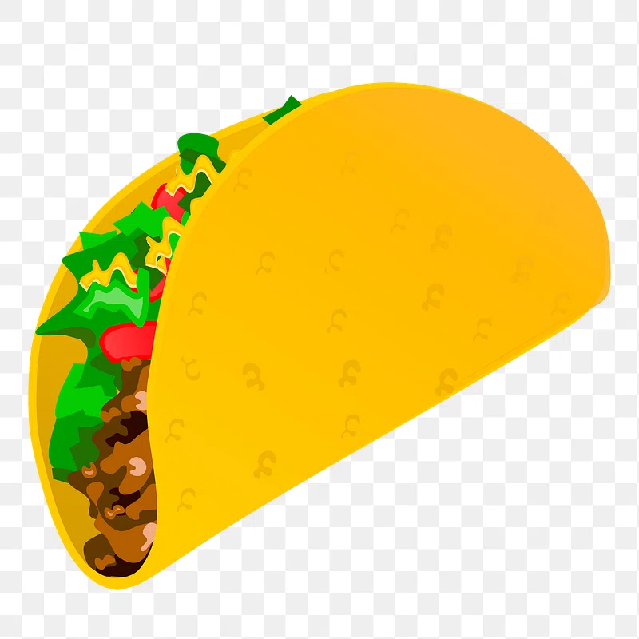

# El Pollo Loco 🌮🐔

A 2D jump'n'run browser game built with vanilla JavaScript and the HTML5 Canvas API. Help Pepe fight his way through the desert, dodge chickens, collect coins and salsa bottles, and defeat the Boss Chicken.



## Play

Open `index.html` in a browser, or serve the folder with a local web server (recommended, since audio/assets are loaded via relative paths):

```bash
npx serve .
# or
python3 -m http.server 8000
```

Then visit `http://localhost:8000` (or the printed URL) and click **Start Game**.

## Controls

| Key | Action |
|---|---|
| ← / → | Move left / right |
| ↑ / Space | Jump |
| D | Throw salsa bottle |

On touch devices, on-screen buttons for movement, jumping, and throwing appear automatically.

## Gameplay

Guide Pepe through the desert level, defeating regular and small chickens by jumping on them or throwing salsa bottles. Collect coins and salsa bottles along the way — save enough salsa for the final showdown with the Boss Chicken. Status bars track health, coins, and salsa bottle count throughout the run.

## Features

- Object-oriented architecture (`MovableObject`, `DrawableObject`, and subclasses for character, enemies, collectibles, and UI)
- Sprite-based animations for idle, walk, jump, hurt, and death states
- Parallax scrolling background with layered scenery and clouds
- Collision detection for enemies, collectibles, and thrown objects
- Boss fight with alert, attack, hurt, and death animation sequences
- In-game settings dialog to mute/unmute music and sound effects (persisted via `localStorage`)
- Responsive layout with dedicated mobile touch controls and rotate-device hint

## Tech Stack

Plain HTML5, CSS3, and JavaScript (ES6 classes) — no frameworks, bundlers, or dependencies required.

## Project Structure

```
├── index.html          # Game markup and UI screens
├── style.css            # Styling and responsive layout
├── js/game.js            # Game bootstrapping, UI/dialog logic, settings
├── levels/level1.js      # Level definition (enemy/object placement)
├── models/               # Game object classes (character, enemies, level, world, etc.)
├── img/                  # Sprites, backgrounds, UI assets
└── audio/                 # Sound effects and background music
```

## License

No license specified.
